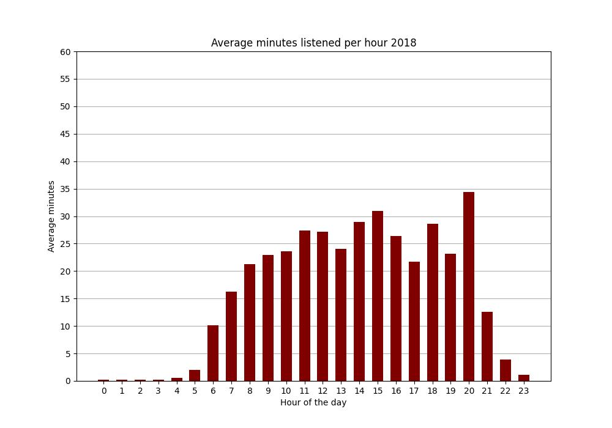

# Analyse Your Spotify Data

I made this python project to analyse my Spotify data.

## Get your Spotify data
Trough https://www.spotify.com/nl-en/account/privacy/ and selecting **Extended streaming history** you can request your 
own streaming data. This from the start to account to the moment of request. It takes ~30 days to get the data. (Be 
sure to download it in 15 days after getting the email! Otherwise, the link will expire. I learned this the hard way :/)

## Installation

Use the package manager [pip](https://pip.pypa.io/en/stable/) to install the requirements.

```bash
pip install -r requirements.txt
```

## Folder management
Some folder management is needed before running. Once you have required you streaming history, it will be in a zip file, 
with possible other data you requested. Teh folder that is important is name something like *'Spotify Extended Streaming 
History'* or *'MyData'*. it will include a pdf that explains the data, and json files with names like 
*'Streaming_History_Audio_2016-2017_0.json'*. Unzip the zipfile.

***It is important that the names of the json files or generated csv files are never changed.***

It is recommended to place the folder with json data in the same folder as main.py, but it is not required. (Make sure 
the json files are in their own folder, but the pdf can stay in that folder too).

```python
spotify_data_folder = 'Spotify Extended Streaming History'
```
In main there is the variable *spotify_data_folder*, this is the name or the path to the folder containing the json files.


## Usage
In *main.py* there are a few more important and less important variables.
```python
if __name__ == '__main__':
    username = 'Anna'
    start_year = 2016
    end_year = 2024
    convert = True
    save = True
    spotify_data_folder = 'Spotify Extended Streaming History'
```
**Username**: Can be anything, this is just for naming the folders where the cleaned and analysed data will be saved. 
This has nothing to with your Spotify username.
```python
username = 'Anna'
```
**start_year**: Important, can be later than the first year that is in the data (look at the json file names to see the 
earliest included year).
**end_year**: Important, can be earlier than the last year, but not later.
```python
start_year = 2016
end_year = 2024
```
**convert**: boolean, when running the code for the first time with new data set to True. Set to False when already run 
once with the current data. 
```python
convert = False
```
**save**: boolean, when set to True the data is saved as Excel files and plots under the folder analysed_data_username. 
When set to False the only output is DataFrames or Plots.
```python
save = True
```

## Code Explanation
What will happen when running the code?

When convert=True, the raw json data will be cleaned up and split into csv files per year. These files will be saved 
under *analysed_data_username*. It is important that these files are not moved or 
the names are changed. 

When you want to run the following functions multiple times (for example you do not want to run 
them at the same time), make sure to set *convert* to **False**, because after the first time running the csv files will 
be created and saved under *cleaned_data_username*, and it is not necessary to run it again (if the years have not changed)


#### TOP PER YEAR
Returns the item sorted on the frequency of the times listened. It returns a 
dictionary, where the key is the year, and the value is the dataframe. When save=True, the dictionary is saved in an 
Excel file, where each dataframe is on a different sheet. If you do not want to run a function 
(for example you never listened to podcasts), you can comment the function.

#### UNIQUE PER YEAR
Returns a dataframe with the number of unique items per year, and the number 
of unique items over the total range of years.

#### MINUTES PER YEAR
Returns a dataframe with the minutes/hours/days listened to per year, for 
the total, tracks and episodes. 

#### PLOT
Returns a plot for every year, containing the average minutes listened to per hour. 


